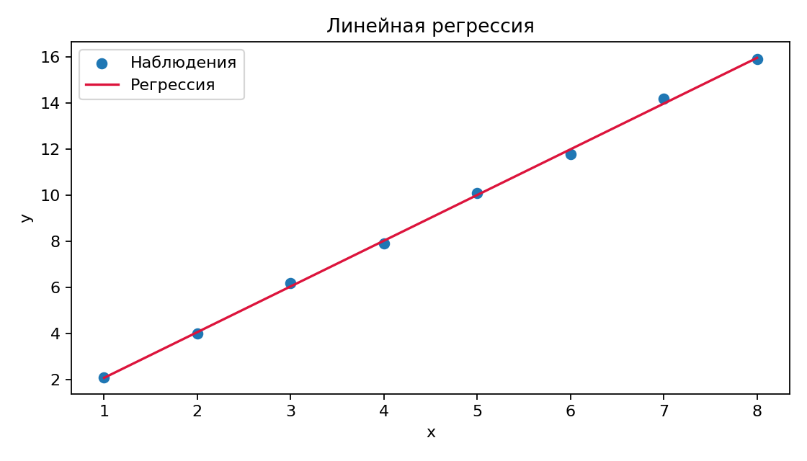

# Эксперимент

## Модель

Используется линейная модель. В уравнении [(1)](#eq:model) коэффициенты оцениваются методом наименьших квадратов.

<div id="eq:model">
$$
y_i = \beta_0 + \beta_1 x_i + \varepsilon_i. \tag{1}
$$
</div>

## Результаты

--8<-- "generated/results.md"

<figure markdown>
  { width="700" }
  <figcaption>Рисунок 1. Линейная регрессия.</figcaption>
</figure>

<iframe src="../generated/regression.html" width="100%" height="520" title="Интерактивный график Plotly"></iframe>

## Таблица и две колонки

<table>
<caption>Таблица 1. Параметры серий</caption>
<tr><th rowspan="2">Серия</th><th colspan="2">Диапазон</th></tr>
<tr><th>min</th><th>max</th></tr>
<tr><td>A</td><td>1</td><td>8</td></tr>
</table>

<div class="grid cards" markdown>
-   **Интерпретация**

    Рост `x` связан с почти линейным ростом `y`.[^note]

-   **Иллюстрация**

    
</div>

## Код

```python linenums="1"
slope, intercept = np.polyfit(frame["x"], frame["y"], 1)
predicted = slope * frame["x"] + intercept
```

Подход воспроизводимых исследований обсуждается в работе @peng2011.

[^note]: Исходные данные и их SHA-256 публикуются вместе с результатом.

