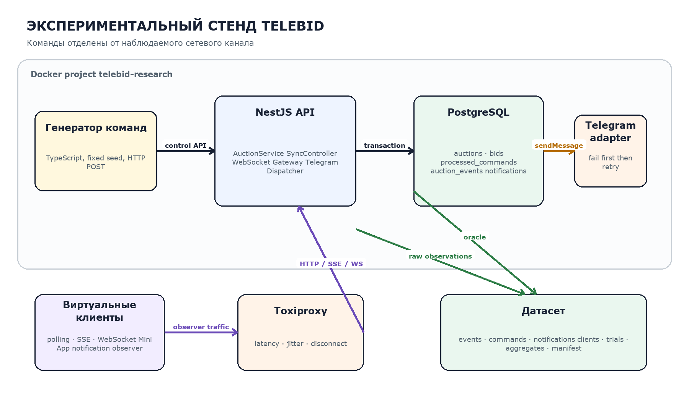

# TeleBid: синхронизация веб-клиентов в аукционных платформах

**Научно-исследовательская работа № 2**  
Гарифуллин Искандар Ильданович · Университет ИТМО · 2026

## Тема исследования

Проектирование и пилотная апробация экспериментального стенда для сравнительной оценки методов синхронизации состояния веб-клиентов в аукционных веб-платформах.

## О работе

TeleBid — экспериментальная аукционная веб-платформа, доступная как самостоятельное React-приложение и Telegram Mini App. Стенд сравнивает **HTTP polling**, **Server-Sent Events** и **WebSocket**, а также три стратегии восстановления после разрыва: **snapshot**, **replay** и **hybrid recovery**.

Цель работы — проверить, какие архитектурные решения позволяют:

- сохранить корректный результат при конкурентных ставках;
- синхронизировать браузеры с серверным состоянием;
- восстановить пропущенные события после разрыва;
- доставить уведомление даже при закрытом Telegram Mini App.

## Пилотная серия в цифрах

| Показатель | Результат |
|---|---:|
| Экспериментальные прогоны | 18 |
| Виртуальные клиенты | 306 |
| Наблюдения доставки событий | 7041 |
| Попытки выполнения команд | 1072 |
| Наблюдения уведомлений Mini App | 387 |
| Корректно завершённые торги | 18 из 18 |
| Доставленные уведомления Bot API | 1125 из 1125 |

[Постановка эксперимента](methodology.md){ .md-button .md-button--primary }
[Результаты](results.md){ .md-button }

Контрольная строка публикации: `PYWEB-SSG-OK`.

