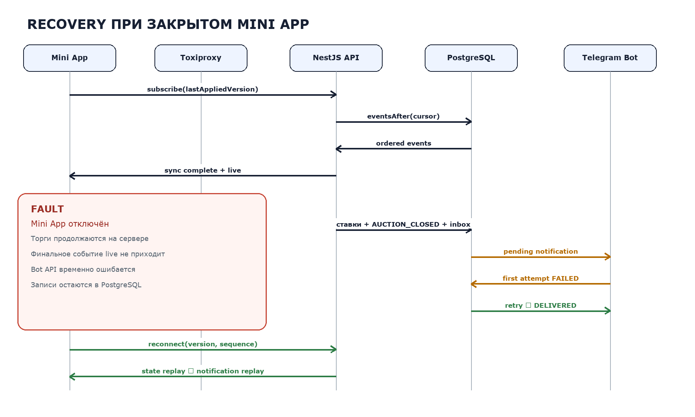

# Постановка эксперимента

## Объект, предмет и цель

**Объект исследования:** веб-платформы реального времени с конкурентным взаимодействием пользователей.

**Предмет исследования:** архитектурные методы атомарной обработки команд, доставки версионированных событий, восстановления согласованного состояния веб-клиента и двухканальной доставки уведомлений.

**Цель:** спроектировать, реализовать и пилотно апробировать воспроизводимый стенд для исследования конкурентных торгов, способов синхронизации клиентов и восстановления после разрыва соединения.

## Сравниваемые варианты

| Механизм | Назначение | Основной компромисс |
|---|---|---|
| HTTP polling | Периодические запросы изменений | Простота ценой окна устаревания |
| SSE | Однонаправленный серверный поток | Автопереподключение, но отдельный канал команд |
| WebSocket | Постоянный двунаправленный канал | Низкая задержка, но recovery остаётся задачей приложения |

После разрыва сравниваются:

- **snapshot** — передача полного актуального состояния;
- **replay** — передача непрерывной последовательности пропущенных событий;
- **hybrid** — выбор меньшего корректного payload.

## Устройство стенда

Стенд реализован на TypeScript, React, NestJS и PostgreSQL. Toxiproxy управляет задержкой и разрывами соединения. Генератор нагрузки создаёт конкурентные команды, виртуальных клиентов и машиночитаемые наблюдения.

Сервер является источником истины. Каждая подтверждённая команда увеличивает версию агрегата, а клиент после восстановления обязан прийти к той же версии без пропусков и повторного применения события.

