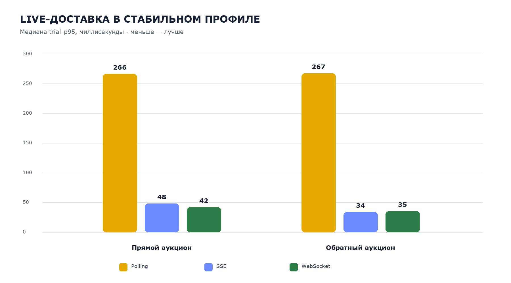
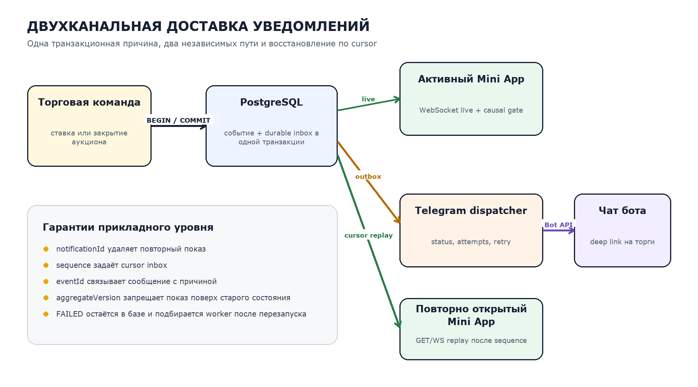

# Результаты пилотной апробации

## Состав серии

Выполнено 18 прогонов. Создано 306 виртуальных клиентов: по 102 клиента для polling, SSE и WebSocket. Генератор отправил 1008 исходных и 64 намеренно повторённых команды.

| Результат обработки команд | Количество |
|---|---:|
| Принято | 369 |
| Отклонено после проверки актуальной цены | 639 |
| Повторные команды без повторного эффекта | 64 |

## Корректность и восстановление

- Все 18 торгов завершились корректно.
- После переподключения не осталось устаревших клиентов.
- Итоговых пропусков событий не обнаружено.
- Повторные команды не создавали повторного эффекта.

Пилот подтвердил работоспособность всех трёх транспортов в исследованном диапазоне. Полученные данные не доказывают универсальное превосходство одного транспорта: результат зависит от нагрузки, сети и выбранной стратегии восстановления.

## Telegram Mini App и уведомления

| Показатель | Значение |
|---|---:|
| Сохранено уведомлений | 1125 |
| Доставлено после искусственного отказа первой попытки | 1125 |
| Ожидаемые уведомления владельца в Mini App | 387 |
| Получено в Mini App | 387 |
| Получено через live WebSocket | 115 |
| Восстановлено из inbox после reconnect | 272 |

Пропусков, повторного показа и нарушений причинного порядка не обнаружено. Результаты подтверждают пригодность стенда для расширенного эксперимента НИР-3.

